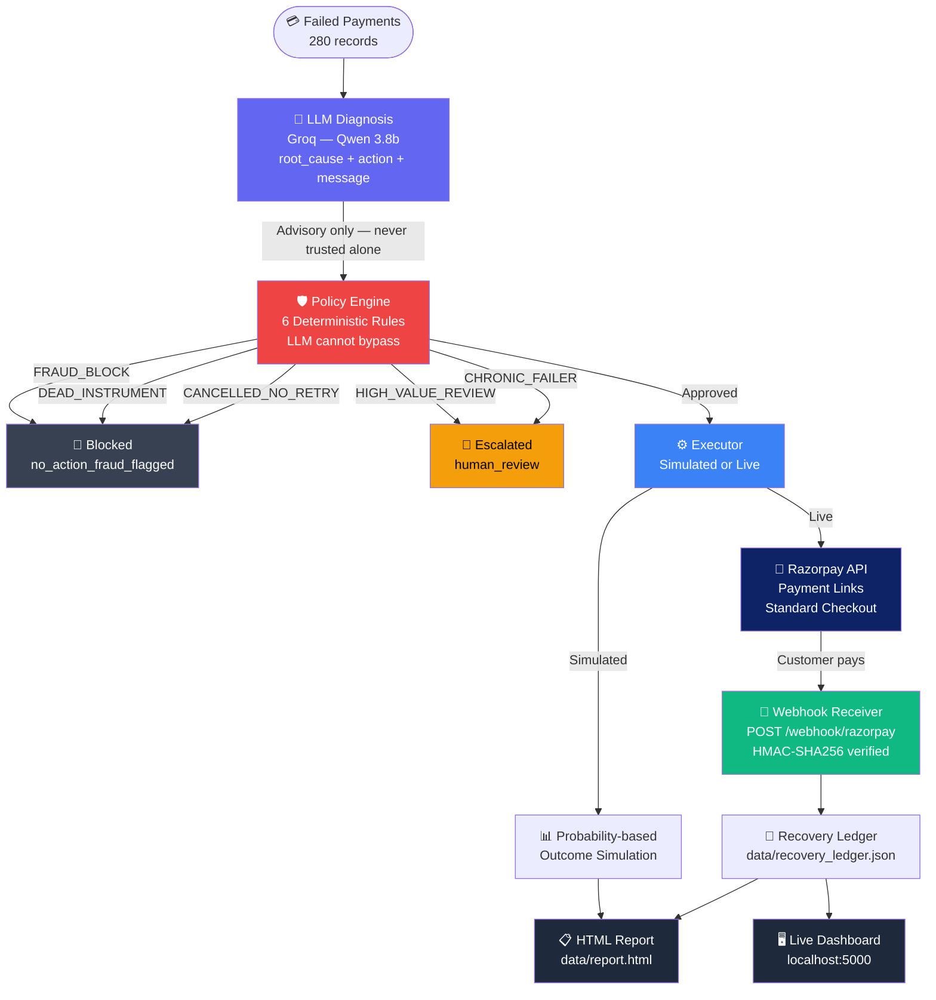

<div align="center">

# ⚡ Razorpay Revive — AI Revenue Recovery Agent

**An autonomous AI agent that diagnoses failed payments, enforces deterministic recovery rules through a policy engine, creates real Razorpay Payment Links, and tracks recovered money in real time via webhooks.**

[](https://www.python.org/)
[](https://flask.palletsprojects.com/)
[](https://razorpay.com/docs/)
[](https://console.groq.com/)
[](LICENSE)
[](https://razorpay.com/)

</div>

---

## What is Razorpay Revive?

Razorpay Revive is an end-to-end revenue recovery system for failed payments. Unlike naive retry systems that blindly resend declined transactions, Revive:

- 🧠 **Diagnoses** — a Groq-powered LLM reads each failure reason and recommends the right recovery action
- 🛡️ **Enforces** — a deterministic Policy Engine overrides the LLM when hard rules apply (fraud, expired cards, chronic failers)
- 💳 **Executes** — creates real Razorpay Payment Links and a Standard Checkout page for live recovery
- 📡 **Confirms** — a webhook receiver listens for `payment.captured` events and maintains a live recovery ledger
- 📊 **Reports** — a self-contained HTML dashboard shows recovery rates, policy breakdown, and per-record audit trail

> **Critical design principle**: LLMs are never trusted for monetary authorization. The LLM reasons. The Policy Engine decides. This matches how real financial systems handle risk.

---

## Results (280 Failed Payments)

| Metric | Value |
|---|---|
| Total revenue at risk | ₹1,91,350.09 |
| Recovered | ₹40,871.00 |
| **Recovery rate** | **21.4%** |
| LLM success rate | 100% (zero fallbacks) |
| Policy overrides | 17% (guardrails fired) |
| Fraud auto-blocked | 2 payments |
| Dead instruments retried | 0 (guardrail prevented all) |

### Breakdown by Error Code

| Error Code | Action Taken | Recovery Rate |
|---|---|---|
| `gateway_technical_error` | retry_immediate | ~70% |
| `bank_technical_error` | retry_immediate | ~60% |
| `payment_timed_out` | retry_scheduled | ~55% |
| `insufficient_funds` | notify_customer | ~18% |
| `authentication_failed` | notify_customer | ~18% |
| `payment_risk_check_failed` | **BLOCKED** | 0% (by design) |
| `card_expired` | notify_customer | ~10% |

---

## Architecture



---

## Policy Engine — 6 Hard Rules

The Policy Engine sits between the LLM and the Razorpay API. It is deterministic — no LLM output can bypass it.

| # | Rule | Trigger | Outcome |
|---|---|---|---|
| 1 | **FRAUD_BLOCK** | `payment_risk_check_failed` | Always `no_action` |
| 2 | **DEAD_INSTRUMENT** | Expired or bank-blocked card | Redirect to `notify_customer`, never retry |
| 3 | **CANCELLED_NO_RETRY** | Customer-cancelled payment | No immediate retry |
| 4 | **HIGH_VALUE_REVIEW** | Amount > ₹50,000 | Escalate to human review |
| 5 | **CHRONIC_FAILER** | > 5 past failures | Escalate, don't retry |
| 6 | **LOW_SUCCESS_RATE** | Error code with < 5% retry history | `notify_customer` instead of retry |

Every decision — LLM recommendation, policy verdict, final action, outcome — is logged to `data/audit_log.json`.

---

## Live Webhook Flow

When a customer completes a Payment Link or Checkout payment:

```
Customer pays
     │
     ▼
Razorpay servers
     │  POST payment.captured event
     ▼
https://YOUR-TUNNEL/webhook/razorpay
     │
     ▼  HMAC-SHA256 verified (X-Razorpay-Signature header)
Flask receiver (checkout/app.py)
     │
     ▼  idempotent write
data/recovery_ledger.json
     │
     ▼  polled every 3s
localhost:5000 live dashboard counter
```

---

## Project Structure

```
razorpay-revive/
│
├── pipeline.py                  # Simulated batch pipeline (runs in ~6 min)
├── pipeline_live.py             # Live batch pipeline (real Razorpay Payment Links)
│
├── schemas/
│   └── models.py                # Shared contract: enums, dataclasses, validation
│
├── engine/
│   ├── diagnosis.py             # LLM diagnosis engine (Groq / Qwen-3.8b)
│   └── policy.py                # Policy Engine — 6 deterministic guardrail rules
│
├── simulator/
│   ├── executor.py              # Simulated executor (probability-based outcomes)
│   └── real_executor.py         # Live executor (Razorpay Payment Links API)
│
├── razorpay_client/
│   └── client.py                # Razorpay Payment Links API client (dry-run + live)
│
├── reporting/
│   ├── aggregator.py            # Console report generator + audit trail writer
│   └── html_report.py           # Dark-theme self-contained HTML dashboard
│
├── checkout/
│   ├── app.py                   # Flask: checkout + webhook receiver + live stats API
│   ├── recovery_ledger.py       # Thread-safe, idempotent recovery persistence
│   ├── simulate_webhook.py      # Local webhook simulator (no tunnel needed for testing)
│   └── templates/
│       └── index.html           # Standard Checkout UI + live recovery dashboard
│
└── data/
    ├── generate.py              # Synthetic data generator (280 records, seeded RNG)
    ├── razorpay_adapter.py      # Converts real Razorpay API responses → internal format
    ├── failed_payments.json     # Input batch
    ├── diagnosis_results.json   # LLM + policy-approved diagnoses
    ├── action_results.json      # Simulated execution results
    ├── action_results_live.json # Real API execution results
    ├── audit_log.json           # Per-record full audit trail
    ├── batch_summary.json       # Aggregated metrics (feeds HTML report)
    ├── recovery_ledger.json     # Webhook-confirmed live recoveries
    └── report.html              # Self-contained HTML dashboard (open in browser)
```

---

## Setup & Running

### Prerequisites

- Python 3.11+
- A free [Razorpay test account](https://dashboard.razorpay.com/signup) (no real money needed)
- A free [Groq API key](https://console.groq.com/) (for the LLM diagnosis engine)

---

### 1. Clone & Install

```bash
git clone https://github.com/Asdortop/Razorpay-revenue-recovery-agent-.git
cd Razorpay-revenue-recovery-agent-

pip install -r requirements.txt
```

---

### 2. Configure Environment

```bash
# Windows
copy .env.example .env

# Mac/Linux
cp .env.example .env
```

Edit `.env`:

```env
# Razorpay (dashboard.razorpay.com → Settings → API Keys)
RAZORPAY_KEY_ID=rzp_test_YOUR_KEY_ID
RAZORPAY_KEY_SECRET=YOUR_KEY_SECRET

# Groq LLM — free at console.groq.com
GROQ_API_KEY=gsk_YOUR_GROQ_KEY

# Webhook secret — set after creating webhook in Razorpay Dashboard
RAZORPAY_WEBHOOK_SECRET=your_webhook_secret

# Flask
FLASK_SECRET_KEY=any-random-string
```

---

### 3. Run the Batch Pipeline (Simulated)

```bash
python pipeline.py
```

Runtime: ~6 minutes. Outputs:
- Console report with full recovery metrics
- `data/report.html` — open in browser, no server needed
- `data/audit_log.json` — per-record decisions

---

### 4. Start the Live Checkout Server

```bash
python checkout/app.py
```

Open **http://localhost:5000**

The page shows a Razorpay Standard Checkout button and a live recovery counter that updates every 3 seconds from the webhook ledger.

---

### 5. Run the Live Pipeline (Real Payment Links)

```bash
# Dry run — logs all API calls, nothing sent
python pipeline_live.py --dry-run --skip-llm

# Live mode — creates real Razorpay Payment Links
python pipeline_live.py --live --skip-llm
```

---

## Testing

### Test Cards (Razorpay Test Mode)

| Card Number | Result |
|---|---|
| `4111 1111 1111 1111` | ✅ Success |
| `4000 0000 0000 0002` | ❌ Insufficient funds |
| UPI: `success@razorpay` | ✅ Success |
| OTP: `1234` | ✅ Passes |

Expiry: any future date. CVV: any 3 digits.

---

### Simulate Webhooks Locally (no tunnel needed)

```bash
# Fire 5 payment.captured events of Rs.500 each
python checkout/simulate_webhook.py --count 5 --amount 500

# Reset the recovery ledger between demo runs
python checkout/simulate_webhook.py --reset
```

---

### Real Webhook Setup (Cloudflare Tunnel — free, no account needed)

```bash
# Start the tunnel
& "C:\Program Files (x86)\cloudflared\cloudflared.exe" tunnel --url http://localhost:5000
# → prints: https://xxxx.trycloudflare.com
```

In **Razorpay Dashboard → Settings → Webhooks → Add New Webhook**:
- URL: `https://xxxx.trycloudflare.com/webhook/razorpay`
- Events: `payment.captured`
- Copy the Secret → paste into `RAZORPAY_WEBHOOK_SECRET` in `.env`

---

## API Endpoints

| Method | Endpoint | Description |
|---|---|---|
| `GET` | `/` | Checkout demo page + live recovery dashboard |
| `POST` | `/api/create-order` | Creates a Razorpay order, returns `order_id` |
| `POST` | `/api/verify-payment` | Verifies HMAC-SHA256 signature after checkout |
| `POST` | `/webhook/razorpay` | Receives `payment.captured` events from Razorpay |
| `GET` | `/api/recovery-stats` | Live JSON recovery stats (polled every 3s by frontend) |
| `GET` | `/api/health` | Health check |

---

## Tech Stack

| Component | Technology |
|---|---|
| LLM | Groq API — Qwen-3.8b (free tier, 100% structured JSON output) |
| Policy Engine | Pure Python — deterministic, zero LLM involvement |
| Payment API | Razorpay Orders + Payment Links + Webhooks |
| Web Server | Flask |
| Frontend | Vanilla HTML / CSS / JS |
| Persistence | JSON files — thread-safe, idempotent (no database required) |
| Tunnel | Cloudflare Tunnel (trycloudflare.com — free, no account needed) |

---

## Key Design Decisions

**Why a policy engine instead of letting the LLM decide everything?**

LLMs are probabilistic. Financial decisions must be deterministic. The policy engine enforces hard rules regardless of LLM output — a fraud-flagged payment gets blocked every single time, not 99% of the time. This mirrors how Razorpay's internal risk systems actually work.

**Why Groq (free) over GPT-4?**

Hackathon constraint: zero cost. Qwen-3.8b on Groq achieves 100% valid structured JSON output with correct action classification. The constraint forced a cleaner architecture — LLM for reasoning, policy engine for decisions — which is also the correct production architecture.

**Why JSON files instead of a database?**

No setup required — clone and run. The `recovery_ledger.py` module is thread-safe and idempotent. In production, swap it for Postgres/Redis by changing one file.

---

## Audit Trail Sample

```json
{
  "payment_id": "pay_00024",
  "error_code": "payment_risk_check_failed",
  "llm_recommendation": "retry_with_new_instrument",
  "policy_verdict": "OVERRIDDEN",
  "guardrails_triggered": ["fraud_block"],
  "action_taken": "no_action_fraud_flagged",
  "execution_outcome": "blocked_by_guardrail",
  "audit_entry": "DIAGNOSIS: payment_risk_check_failed. LLM: retry_with_new_instrument. POLICY: OVERRIDE — fraud_block. ACTION: no_action_fraud_flagged. OUTCOME: blocked_by_guardrail."
}
```

---

<div align="center">

Built for **Razorpay Buildathon 2026 — Track 03: AI Revenue Recovery**

</div>